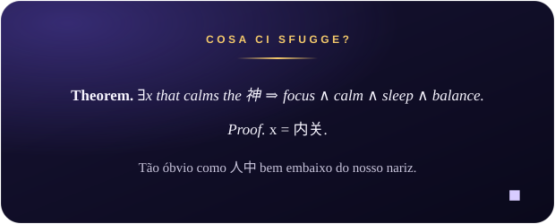

# Franchesca Cappellesso

**Studying Mathematics · Exploring what GitHub can do**

### About me

I love learning. I like to combine the rigor of theory with the curiosity of someone who wants to understand how things work, inside and outside academia.

**Things I love**

- **Mathematics**: my main language, especially analysis, partial differential equations and dynamical systems.
- **Traditional Chinese Medicine**: acupuncture, electroacupuncture, moxibustion, cupping, gua sha, auriculotherapy, cosmetic acupuncture, phytotherapy and diet therapy.
- **Languages**: Portuguese, English and Italian, and always eager to learn more.
- **Microbiology** and **the cosmos**: the subatomic and the astronomical, bridging the realms of particles and spacetime.
- **Literature** and **music from around the world**: food for the soul.
- **Programming and web development**: learning to build new things.

---

### Why I'm here

This profile is my playground for discovering what GitHub can do. Some of the questions I'm exploring:

- Can a text file turn itself into a beautiful PDF?
- Can a repository become a website?
- What can be automated so that it simply happens?
- How far can a profile page go?

I don't know all the answers yet, and that is exactly the fun part.

---

### Explore. Learn. *Stay curious.*

To visit my personal website, click the button below:

 

 

